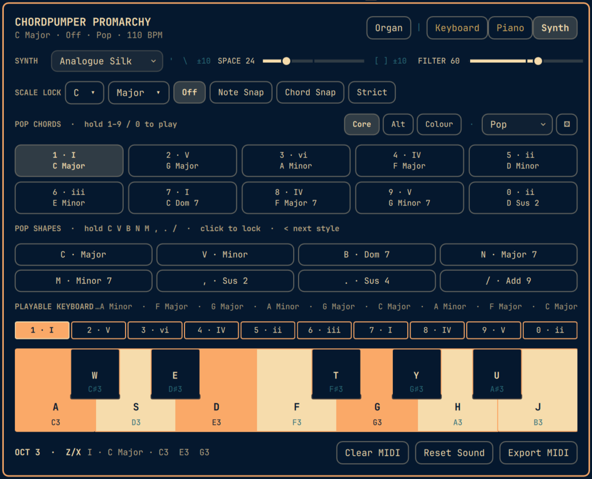

# ChordPumper Promarchy

ChordPumper Promarchy is a keyboard-driven chord, harmony, and MIDI sketchpad for the Omarchy Quattro shell. It turns the Omarchy bar into a quick musical notebook: play a piano, voice chords from the home row, audition style-aware harmony, explore randomized palettes, and export MIDI.



## Features

- Low-latency FluidSynth playback through PipeWire
- One-octave computer-keyboard piano with mouse support
- 24 musical style palettes
- Ten playable, style-aware progression chords
- Eight momentary or lockable chord shapes per style
- Twelve selectable scales with note-snap, chord-snap, and strict modes
- Recent-note history
- Full played-history MIDI export
- Theme-aware Omarchy panel and bar widget

## Requirements

- Omarchy with the Quattro plugin runtime
- Python 3
- FluidSynth
- FluidR3 General MIDI SoundFont

Install the audio dependencies through Omarchy:

```sh
omarchy pkg add fluidsynth soundfont-fluid
```

The plugin bundles no SoundFont, samples, or third-party Python packages.

## Install

```sh
omarchy plugin add https://github.com/stoogs/ChordPumper-Promarchy.git --enable
```

During this interactive installation, Omarchy asks whether the widget should be placed in the **left**, **center**, or **right** bar section. **Center** is preselected from the plugin manifest. The instrument opens with the **Pop** style and Core chord palette by default.

The plugin ID is `io.github.stoogs.chordpumper-promarchy`. Placement can be changed later with, for example:

```sh
omarchy bar move io.github.stoogs.chordpumper-promarchy --section left
```

Replace `left` with `center` or `right` as desired.

Click the compact piano icon in the bar to open the instrument. Hover it to see the full ChordPumper Promarchy name.

## Controls

### Piano

| Action | Keys |
| --- | --- |
| White notes, C through B | `A S D F G H J` |
| Black notes | `W E T Y U` |
| Octave down / up | `Z` / `X` |
| Close panel | `Escape` |

### Style chords

Hold `1` through `9`, or `0` for the tenth slot, to play the ten named progression chords supplied by the active style. The chord stops when the number key is released. Core mode preserves the original chords in slots `1–6`; slots `7–0` add four genre-specific colour voicings.

The on-screen chord tiles are non-interactive key legends; use the corresponding physical number key to play each chord.

The number row has four style-aware chord palettes:

| Palette | Behaviour |
| --- | --- |
| Core | The hand-authored default set for the genre. |
| Alt | The same harmonic vocabulary in an alternate songwriting order. |
| Colour | Keeps the style's roots but applies its characteristic extensions and voicings. |
| Shuffle | Generates another ten-slot palette from that genre's chord roots and chord-shape vocabulary. Click it repeatedly to reshuffle. |

The main **Random** button now selects a style-aware shuffled palette as part of randomizing the whole instrument.

### Chord shapes

The eight visible shapes map left-to-right to:

```text
C V B N M , . /
```

- Hold a shape key to use it temporarily on the piano.
- Release it to return to single-note mode or the clicked lock.
- Click a shape to lock it across every piano root.
- Click the locked shape again to unlock it.

### Styles

Click the style selector for a 6×4 table, or press `<` to move to the next style.

Included styles:

| | | | |
| --- | --- | --- | --- |
| Pop | Rock | Indie | Folk |
| Country | Blues | Soul | Funk |
| R&B | Disco | House | Techno |
| Ambient | Dream Pop | Lo-fi | Synthwave |
| Cinematic | Epic | Jazz | Neo-Soul |
| Bossa Nova | Gospel | Reggae | Classical |

Every style defines six foundational progression chords, four additional colour slots, and eight chord-shape choices. The interface uses compact, familiar theory labels such as `Dom 7`, `Sus 4`, and `Dim 7` where full descriptions would obscure the controls.

### Scale lock

Choose any of the twelve chromatic roots using natural and combined sharp/flat labels, then select a scale from the 4×3 palette.

| | | | |
| --- | --- | --- | --- |
| Major | Natural Minor | Harmonic Minor | Melodic Minor |
| Major Pentatonic | Minor Pentatonic | Blues | Dorian |
| Phrygian | Lydian | Mixolydian | Locrian |

Note Snap is enabled initially. Selecting a root or scale type while locking is Off also enables Note Snap, so changing the scale always has an immediate visible and audible result.

| Mode | Behaviour |
| --- | --- |
| Off | Plays the requested notes without correction. |
| Note Snap | Moves each out-of-scale tone independently to its nearest scale tone. This can alter a chord's quality. |
| Chord Snap | Preserves the complete chord shape and transposes it by the smallest amount that puts every tone in the scale. It blocks chord shapes that have no exact diatonic fit. |
| Strict | Rejects the complete note or chord if any tone is outside the selected scale. |

When scale lock is active, available piano keys remain bright and unavailable keys are dimmed. The requested key uses the current Omarchy accent; any corrected destination notes use the theme's urgent color so the remapping is immediately visible. The rest of the piano also follows the active Omarchy theme.

## Random and MIDI

**Random** selects one of the 24 styles, a shuffled ten-chord palette, one named chord, and a compatible locked chord shape.

**Export MIDI** writes every note and chord played during the current take, in order, to a format-0 Standard MIDI file. Each played gesture occupies one beat so the history is immediately editable as a sequence in a DAW. A take retains up to 4,096 gestures; after that, the oldest gesture is discarded. The filename includes the style, key and scale, chord set, date, and time, for example:

```text
~/Music/ChordPumper Promarchy/jazz-c-major-shuffle-2026-08-31-184512.mid
```

The file can be imported into Bitwig, Reaper, Ardour, Ableton Live, Logic, or another MIDI-capable workstation. The visible Recent strip remains compact, but MIDI export retains the full session history.

**Clear MIDI** starts a fresh take by clearing both the full export history and the visible Recent strip. It requires a second **Confirm clear** click within five seconds; otherwise the clear is cancelled and the take is kept.

## How it works

The QML interface runs inside the existing Omarchy shell process. It starts the bundled Python engine as a child process and sends newline-delimited JSON note events over standard input. The engine controls FluidSynth, while its dependency-free MIDI writer exports the played-event history.

See [Architecture](docs/architecture.md) for the component and security model.

## Privacy and security

Omarchy plugins run unsandboxed with the current user's permissions. ChordPumper Promarchy:

- Invokes its bundled engine with `/usr/bin/python3` and validates the packaged `/usr/bin/fluidsynth` executable before use.
- Does not use the network.
- Does not request elevated privileges.
- Writes files only after Export MIDI is clicked.
- Writes only beneath `~/Music/ChordPumper Promarchy` by default.
- Walks the fixed MIDI export tree from the account home descriptor, rejecting symlinks at every component, then publishes through a private temporary file without overwriting an existing filename.
- Bounds control messages, MIDI values, event history, generated MIDI size, and retained synthesizer diagnostics.
- Supervises FluidSynth as a process group and escalates from graceful exit to termination and a final kill/wait.
- Does not modify Omarchy configuration directly.

Audio dependencies are installed separately and explicitly by the user.

## Remove

```sh
omarchy plugin remove io.github.stoogs.chordpumper-promarchy
```

If no other software needs the optional audio packages, they can also be removed:

```sh
omarchy pkg drop fluidsynth soundfont-fluid
```

MIDI files under `~/Music/ChordPumper Promarchy` are not deleted automatically.

## Development

Validate the repository without installing it:

```sh
omarchy plugin validate .
python3 -m py_compile engine/chordpumper_engine.py
python3 -m unittest discover -s tests -v
```

The shell hot-reloads installed user plugin files. Follow [Contributing](CONTRIBUTING.md) for the development and test checklist.

## License

MIT. See [LICENSE](LICENSE).
